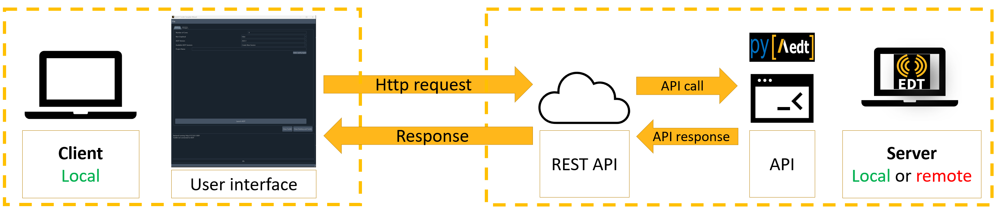

.. _architecture:

Architecture
============

This repository is a common API for any new AEDT toolkit. It standardizes AEDT toolkits implementation.

The API provides some methods to connect to an existing AEDT session, open an existing
AEDT project or initialize a new AEDT session, which should be the basic capability of any toolkit.

The architecture is divided in two main parts:

1. The backend, using `Flask <https://flask.palletsprojects.com/en/2.3.x/>`_. Flask creates a REST API,
which let interact different services by simply doing HTTP requests.

2. The user interface, using `Pyside6 <https://doc.qt.io/qtforpython-6/quickstart.html>`_. Pyside6 has a designer tool
which allows to create user interfaces and it is translated to python directly.

Using Flask, the toolkit becomes interface agnostic, then you can decide change it and use a WebUI for instance
as user interface.

You can install the library like any other open source package. You can add this project as a dependency of the new toolkit.

The architecture is defined in the following picture:

