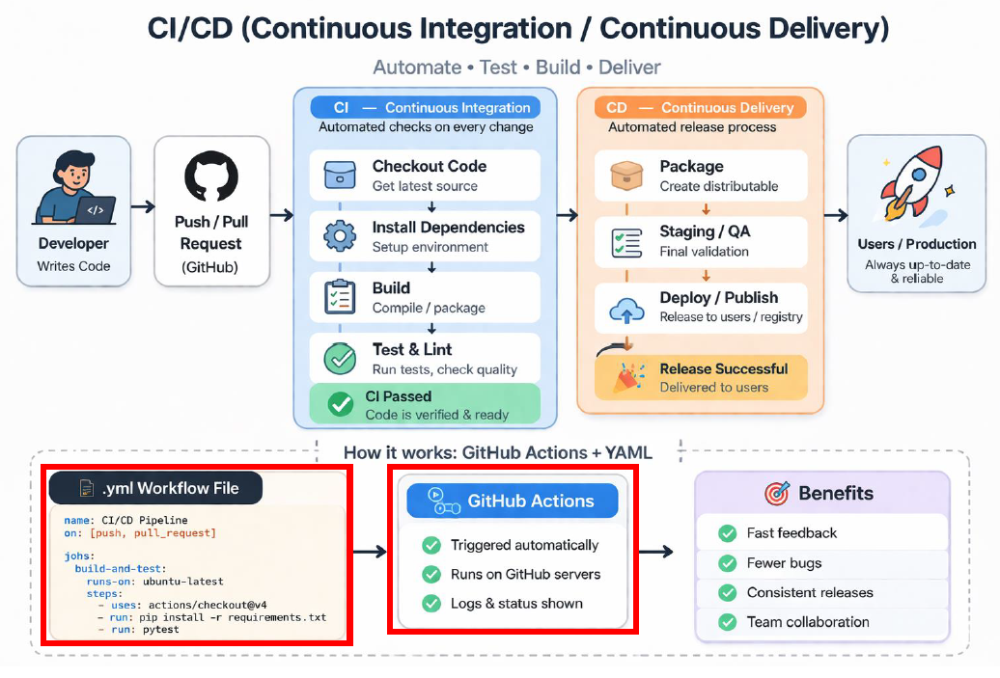
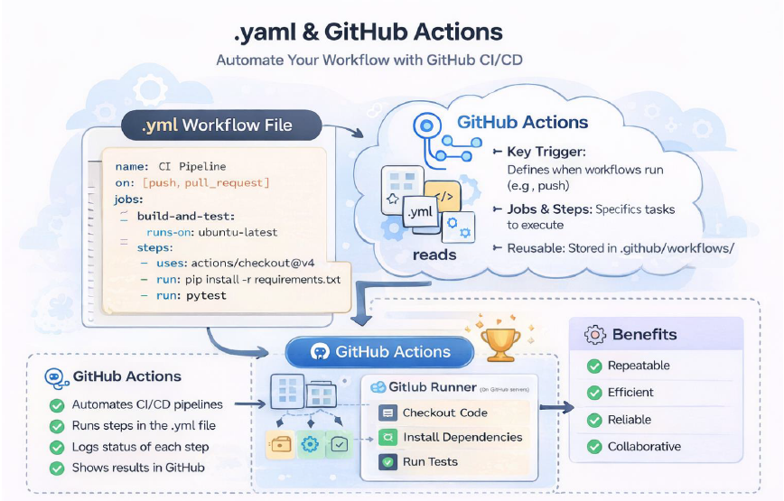
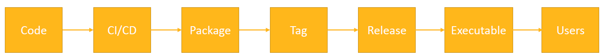

.. _toolkit_setup:

Toolkit setup
=============

CI/CD
~~~~~

What is CI/CD ?

-   **CI**: Continuous Integration
-   **CD**: Continuous Delivery / Deployment

It's a way to automate the process of building, testing, and releasing software

``Continuous Integration (CI)``:
Every time a developer pushes code or opens a pull request (PR),the system automatically:

-   Builds the project
-   Run tests
-   Checks code quality

Why does it matter? Problems are caught immediately and the code base stays stable.

``Continuous Deployment (CD)``:
After CI passes, CD takes over and packages the software and release it.

Where automation lives: GitHub Actions and the importance of the .yml file
~~~~~~~~~~~~~~~~~~~~~~~~~~~~~~~~~~~~~~~~~~~~~~~~~~~~~~~~~~~~~~~~~~~~~~~~~~

A very common tool for CI/CD is GitHub Actions.

GitHub Actions lets you define workflows that run automatically when something happens in
your repository (e.g. on a code push or when publishing a package)

The core piece that defines how to run GitHub Actions is the .yml file.
The .yml file it’s a configuration file that tells GitHub which steps to run and the sequence
they need to be run. It’s the core of the project CI/CD pipeline pipeline.
Usually it’s found in: .github /workflows/ci ci-cd.yml.

Why .yml and GitHub Actions are important?
They make the process repeatable, automated, standardized and collaborative.

.yml file content
~~~~~~~~~~~~~~~~~

What is it? A recipe that tells GitHub Actions exactly how to run your CI/CD pipeline.

It answers 4 key questions:

-   When to run? on : Triggers (when it
-   What to run? jobs: The main building blocks
-   Where to run? runs -on: Execution environment
-   How to run it? steps: The actual work

.yml file simple structure:

name: CI Pipeline
on: [push, pull_request request]-> **when?** Push, pull_request , schedule, manual trigger
jobs: -> **what?** One workflow, can run in parallel or sequentially
  test:
  runs -on: ubuntu-latest-> **where?** Ubuntu/ Windows or GitHub hosted machines
  steps:-> **how?** Steps run commands (run) and use pre pre-built actions (uses)
    -run: pytest

Runners
~~~~~~~

In GitHub Actions, a runner is the machine that executes your workflow steps. In a
.yml, ``runs-on: ubuntu-latest/windows-latest`` means “use a runner with
Ubuntu/Windows installed” or ``runs-on: self-hosted`` means “use a runner that I setup
myself”.

In a .yml file, ``runs-on`` tells the system what kind of machine (runner) should execute
the job.

``ubuntu-latest`` or ``windows-latest`` are a virtual machines (VM) provided by GitHub where everything is pre-configured
and ready to go.

``Self-hosted`` means you are using your own machine (or server) that you set it up by
yourself as a runner. GitHub sends jobs to this machine instead of theirs.

From code to users: Packaging and executable deployment
~~~~~~~~~~~~~~~~~~~~~~~~~~~~~~~~~~~~~~~~~~~~~~~~~~~~~~~

• ``CI/CD``: Automates building , testing , and delivering the code. Triggers everything on push or tag.
• ``Packaging``: Prepares the code to be reused. It creates installable artifacts (libraries and wheels)
• ``Tags and releases``:
    -   Tag: Version maker (e.g. v1.0.0)
    -   Release: Official distributed version. Often triggers CI/CD to publish artifacts.
• ``Executable deployment``: makes the code runnable without Python. Produces an .exe.

