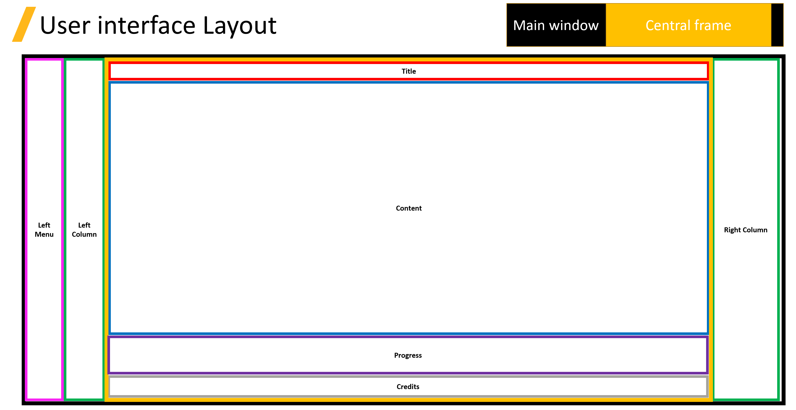

.. _user_interface:

============
UI reference
============

This library contains a versatile library designed to streamline the process of creating standard desktop applications
using the `Pyside6 <https://doc.qt.io/qtforpython-6/quickstart.html>`_.
The user interface (UI) API provides a set of pre-built components, utilities, and an API that simplifies
the development of robust and user-friendly applications.

The user interface (UI) API contains three main modules: **Utils**, **Windows**, **Generic actions**:

.. grid:: 2

    .. grid-item-card:: Utils :fa:`person-running`
        :padding: 2 2 2 2
        :link: ui_reference/utils
        :link-type: doc

        Common user interface classes to define widgets and load templates.

    .. grid-item-card:: Windows :fa:`book-bookmark`
        :padding: 2 2 2 2
        :link: ui_reference/windows
        :link-type: doc

        Defaults windows initialization.

    .. grid-item-card:: Generic actions :fa:`scroll`
        :padding: 2 2 2 2
        :link: ui_reference/actions
        :link-type: doc

        Generic methods to call the REST API.

.. toctree::
   :hidden:

   ui_reference/utils
   ui_reference/windows
   ui_reference/actions

The provided user interface has the following structure:

The user interface is contained inside the main window. The main window contains some common widgets that are by default
initialized, such as the credits, title... New pages are added in the content widget.

You can find how to initialize the `UI example <https://github.com/ansys-internal/pyaedt-toolkits-common/tree/main/examples/ui/default_ui_exampley>`_.
